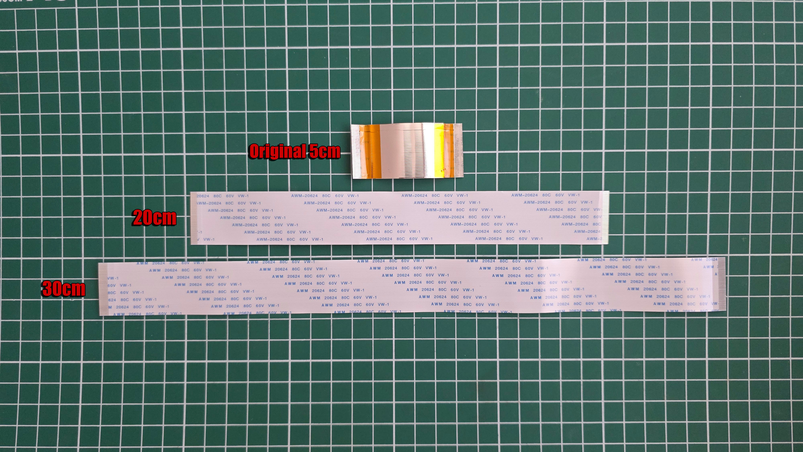

# FC1307A PSX DVR Firmware

Custom firmware for FC1307A SD-to-IDE adapters, adding support for the Sony PSX DVR vendor-specific HDD verification command `0x8E`.

The original FC1307A firmware does not support this command, causing the PSX to reject the adapter. This version adds the required 512-byte PIO response using the original FC1307A transfer routine.

The firmware extends SD card support beyond the original 128 GB limit and has been successfully tested with 256 GB and 1 TB cards.

It can also be used with compatible FC1307A-based 44-pin SD-to-IDE adapters commonly installed in PS2 Slim SCPH-700xx consoles.

## How the HDD check works

During startup, the PSX verifies the internal drive by writing `0xEC` to the ATA Features register and then issuing the vendor-specific command `0x8E`.

In the tested startup sequence, the console performs this verification twice.

```text
Features = 0xEC
Command  = 0x8E

Status   = 0xD0   BSY — drive is preparing the response
Status   = 0x58   DRQ — data is ready
Data     = 256 × 16-bit words = 512 bytes
Status   = 0x50   command completed without error
```

This is not a normal sector read. The command requests a Sony-specific 512-byte identification response.

The first 128 bytes contain identification and binary data, including:

```text
Sony Computer Entertainment Inc.DESR-7000        120
```

The remaining 384 bytes are filled with zeros. If the drive does not return the expected data transfer and status sequence, the PSX rejects it.

## Video

[Watch the full FC1307A PSX DVR modification video on YouTube](https://youtu.be/S4Ubpu-f1K8)

## Tested hardware

- Sony PSX DESR-5000
- Sony PSX DESR-5100
- Sony PSX DESR-7000
- Sony PSX DESR-7100
- 64 GB, 256 GB and 1 TB SD cards
- FC1307A-based 40-pin SD-to-IDE adapter
- FC1307A-based 40-pin MicroSD-to-IDE adapter
- FC1307A-based 44-pin SD-to-IDE adapter for PS2 Slim SCPH-700xx

## Connecting the adapter to the PSX

> [!CAUTION]
> The 40-pin IDE connector in the PSX is mounted upside down compared with a standard IDE hard drive. It has no key, so the cable can easily be connected the wrong way around.
>
> Before powering on the console, compare the cable orientation with the original HDD and make sure pin 1 is in the correct position. Connecting it backwards may damage the adapter or the console.

## FFC cable extension tests

The original ribbon cable between the PSX mainboard and the IDE connector board is approximately 5 cm long. This leaves very little room for positioning an SD-to-IDE adapter inside the console.

The cable used in the tested first-generation PSX consoles has the following specification:

- 50-pin FFC
- 0.5 mm pitch
- Contacts on the same side at both ends
- Original length: approximately 5 cm

Initial tests were performed with replacement cables measuring 20 cm and 30 cm.

Both cable lengths successfully allowed the PSX to boot the system from the SD card using the FC1307A adapter.

The **20 cm cable is currently recommended**, as it provides significantly more room for positioning the adapter while keeping the cable as short as reasonably possible.

> [!NOTE]
> These were initial functionality tests only. Long-term stability, HDD recording, game loading and extended read/write operations have not yet been fully tested with the longer cables.
>
> The 30 cm cable successfully booted the PSX system, but the 20 cm version is preferred unless the additional length is required.

### Test photos

Photos from the 20 cm and 30 cm cable tests, are available in the repository:

[View PSX1 FFC extension cable test photos](docs/images/psx1/ffc-extension/)

### Cable comparison



## Preparing the card

1. Flash the modified firmware to the FC1307A adapter.
   - Tested SPI flash IC: `BY25D40EST`
   - Adapter production batches may use differently marked compatible 512 KB SPI flash chips.
2. Format the card using the original uLaunchELF HDD Manager on the PSX.
   - An FMCB memory card is required to run uLaunchELF on the PSX.
3. Copy the contents of the `__system` and `__sysconf` partitions.
4. When using system files copied from another console, another source or a different PSX model, delete:

   ```text
   hdd0:__system/registry.db
   ```

   The file may be kept when restoring a backup created on the same console to that same console. Otherwise, it will be recreated automatically during the next startup.
5. Power off the console completely and start it again.

A full sector-by-sector HDD image is not required. The same PSX1 system files can be used on different first-generation PSX models after formatting the drive and removing `registry.db`.

## Troubleshooting

### Incorrect `__system` partition size

In some cases, uLaunchELF HDD Manager may create the `__system` partition with a size of only 32 MB instead of the expected 256 MB.

Do not copy the system files if the partition was created with the incorrect size.

If this happens:

1. Fully power off the console and format the card again.
2. If the problem persists, try a different SD card.

The exact cause of this issue has not yet been identified. During testing, the same FC1307A adapter and SD card were formatted correctly in another supported first-generation PSX console, suggesting that the problem may depend on the specific console, adapter and card combination.

## PSX OS v1.31

- [Polish version](https://repairbox.pl/PSX_DVR/Rev1/RepairBox_PSX1_SystemFiles_PL_v1.31.zip)
- [English version](https://repairbox.pl/PSX_DVR/Rev1/RepairBox_PSX1_SystemFiles_EN_v1.31.zip)
- [Original Japanese version](https://repairbox.pl/PSX_DVR/Rev1/RepairBox_PSX1_SystemFiles_JP_v1.31.zip)

## uLaunchELF

- [Download uLaunchELF for PSX](https://drive.google.com/file/d/1lH7ACkzD-JeFkqIqr2MXoNCG47ncfXEX/view?usp=sharing)

> [!WARNING]
> Always make a backup of the original SPI flash before programming.
>
> Verify that the adapter uses an FC1307A controller and a compatible 512 KB SPI flash chip before flashing.
